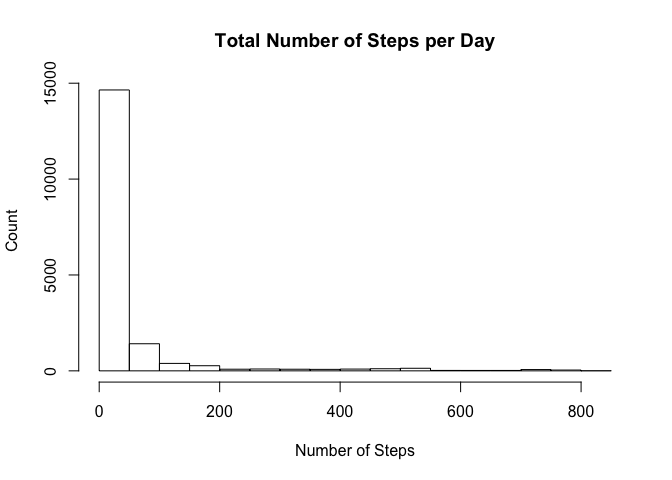

# Reproducible Research: Peer Assessment 1

This report uses data from a personal activity monitoring device, which collects data at 5 minute intervals throughout the day. The data consists of two months of data from an anonymous individual and includes the number of steps taken in 5 minute intervals each day.


Loading the lattice package from the library


```r
library(lattice)
```

## Loading and preprocessing the data


```r
unzip("activity.zip", files=NULL, overwrite=TRUE, exdir=".", unzip="internal", setTimes=FALSE)

data <- read.csv("activity.csv", na.strings = "NA")
```

## What is mean total number of steps taken per day?

First we calculate the total number of steps per day. Then, we draw a histogram showing a count of totals. The last step is calculating the mean and median. 


```r
## Calculating total number of steps per day
## Creating a list of date variable and use it in aggregate()

dateList <- list(data$date)
newData <- aggregate(data$steps, by= dateList, FUN=sum)

## Creating a histogram of a count total number of steps per day
## newData[,2] is the column of total number of steps

hist(newData[,2], main = "Total Number of Steps per Day", xlab="Number of Steps", ylab="Count")
```

 

```r
## Calculating the mean and median of total number of steps with NA values ignored
newDataMean <- mean(newData[,2], na.rm=TRUE)
newDataMedian <- median(newData[,2], na.rm=TRUE)
```
Mean is 1.0766189\times 10^{4} ,  and median is 10765

## What is the average daily activity pattern?


```r
## Calculating the average daily pattern by calculating the mean of steps by interval

intervalList <- list(as.factor(data$interval))
avg <- aggregate(as.numeric(data$steps), by=intervalList, FUN=mean, na.rm=TRUE)
colnames(avg) <- c("interval", "stepsMeans")

## Plotting data
xyplot(avg$stepsMean ~ avg$interval, data=avg, type='l', xlab="Interval", ylab="Average Number of Steps")
```

 

Which 5-minute interval, on average across all the days in the dataset, contains the maximum number of steps?


```r
max <- avg[avg$stepsMeans== max(avg$stepsMeans),]
maxNum <- as.character(max[,1])
```

Interval 835 contains the maximum number of steps


## Imputing missing values

Calculating total number of missing values in the original dataset

Missing values in the dataset are replaced by means for that 5-minute interval


```r
num <- nrow(data[data$steps=="NA",])
num
```

```
## [1] 2304
```

```r
## Creating a new dataset 
dat <- data

## Replacing missing values by means of the corresponding 5-minute intervals in the new dataset

for(i in 1:nrow(dat)){
          if(is.na(dat[i,1])){
                dat[i,1] <- avg$stepsMeans[avg$interval==dat[i,3]] 
          }
}
```
## Missing data filled in


```r
hist(dat$steps, main = "Total Number of Steps per Day", xlab="Number of Steps", ylab="Count")
```

 

```r
datMean <- mean(dat$steps)
datMedian <- median(dat$steps)
```

Mean is 37.3825996 ,  and median is 0

## Are there differences in activity patterns between weekdays and weekends?

Creating a new factor variable in the dataset with two levels – “weekday” and “weekend” 


```r
day <- weekdays(as.Date(dat$date))

# Adding a new variable to the dataset with days added
newDat <- cbind(dat, day)

# Creating an empty character vector with length equal to newDat
week <- vector(mode="character",length=nrow(newDat))

## Looping through all dataset and indicating whether a given day is a weekday or a weekend
## then saving the result in the week vector

for(i in 1:nrow(newDat)){
        if(as.character(newDat[i,4]) =="Saturday" | as.character(newDat[i,4])=="Sunday"){
                week[i] <- "weekend"
        }else{
                week[i] <- "weekday"
        }
}

## Adding a new column to newDat
newDat <- cbind(newDat, week)

## Dividing the datset into 2 according to week variable 
weekdayData<- newDat[newDat$week == "weekday",]
weekendData <- newDat[newDat$week == "weekend",]

## Creating a list of intervals in both new datasets
weekdayIList <- list(as.factor(weekdayData$interval))
weekendIList <- list(as.factor(weekendData$interval))

## Calculating the mean of steps in both datasets
avgWeekday <- aggregate(weekdayData$steps, by= weekdayIList, FUN=mean)
avgWeekend <- aggregate(weekendData$steps, by= weekendIList, FUN=mean)

## Calculating number of rows in avgWeekday, which is equal to that of avgWeekend
numRows <- nrow(avgWeekday)

##  Creating a new weekdayVec, a new vector, and filling it with "weekday"
weekdayVec <- vector(mode="character")
weekdayVec <- c(weekdayVec,"weekday")
weekdayVec <- rep(weekdayVec, numRows)

## Doing the same with weekendVec
weekendVec <- vector(mode="character")
weekendVec <- c(weekendVec,"weekend")
weekendVec<-rep(weekendVec, numRows)

## Combining data of means with weekdayVec and weekendVec
avgWeekday <- cbind(avgWeekday,weekdayVec)
avgWeekend <- cbind(avgWeekend,weekendVec)

## Changing Column names
colnames(avgWeekday)<-c("interval","steps","week")
colnames(avgWeekend)<-c("interval","steps","week")


avgWeekSplitData<-rbind(avgWeekday,avgWeekend)

## Plotting data
xyplot(steps ~ interval | week, data = avgWeekSplitData, layout = c(1, 2),type='l', ylab="Number of steps", xlab="Interval")
```

 

There is a difference in the activity pattern during weekday and weekend. The device reports that there are higher activity levels during weekday at certain intervals.


